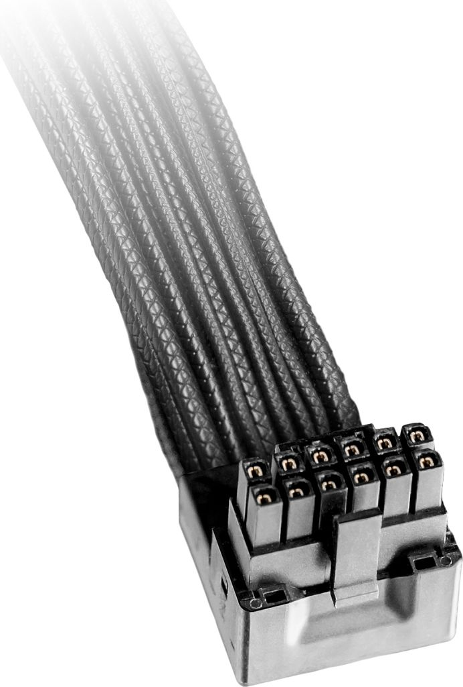

# Conector: 12VHPWR / 12V-2x6

**Descripción breve:** Nuevo estándar de alimentación para tarjetas gráficas PCIe de última generación. Sustituye a los conectores PCIe de 6/8 pines, permitiendo entregar hasta 600W a través de un solo cable compacto y seguro.  
**Pines/Carriles/Voltajes/Velocidad:** 16 pines (12 para potencia + 4 de “sense”) · +12V · Hasta 600W   
**Uso principal:** Alimentación exclusiva para GPUs modernas (NVIDIA RTX 40 series y futuros modelos PCIe 5.0 y superiores).    
**Compatibilidad actual:** Alta

## Identificación física
- Conector rectangular y compacto de 16 pines (12 de potencia, 4 más pequeños de detección/sense).

Etiquetado como "H+" (12VHPWR) o "H++" (12V-2x6 en la última revisión).

Conectores y cables reforzados para soportar altas cargas y evitar problemas de temperatura/mala inserción.

## Notas técnicas
- El 12VHPWR original entrega hasta 600W y 55A desde la fuente de alimentación a la GPU con líneas de +12V; el 12V-2x6 mejora seguridad y fiabilidad.

Los 4 pines “sense” detectan si el cable está correctamente insertado y configuran el límite de potencia según la fuente y GPU (300W, 450W o 600W).

El estándar 12V-2x6 introduce mejoras críticas: mejor diseño de pines, menor riesgo de sobrecalentamiento y mejor detección de inserción total, minimizando incidentes reportados con 12VHPWR.

## Fotos

## Fuentes
- https://www.tomshardware.com/news/16-pin-power-connector-gets-a-much-needed-revision-meet-the-new-12v-2x6-connector

- https://gamertech.org/singlenews/12V-2x6