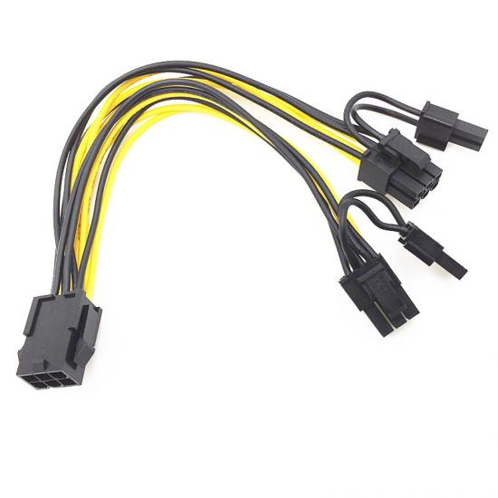

# Conector: PCIe 6/8P

**Descripción breve:** Conector especializado para suministrar energía adicional a tarjetas gráficas/GPUs (PCI Express) de alto rendimiento en equipos de escritorio y workstations.
**Pines/Carriles/Voltajes/Velocidad:**  6 pines · +12V hasta 75W / 8 pines · +12V hasta 150W
**Uso principal:** Alimentación de tarjetas gráficas y otros dispositivos PCIe de alto consumo.e  
**Compatibilidad actual:** Alta

## Identificación física
- Conector rectangular de 6 pines (2 filas de 3) o de 8 pines (2 filas de 4). Suele aparecer en formato 6+2 para máxima versatilidad. Se conecta directamente a la GPU y está claramente etiquetado como PCI-e.

## Notas técnicas
- El PCIe 6 pines ofrece 75W adicionales a la GPU, mientras que el 8 pines entrega hasta 150W, gracias a dos pines extra que actúan como "sense" para informar a la gráfica de la potencia disponible.

No debe confundirse con el conector EPS 8p pese a la similitud física, ya que la disposición y cableado interno son diferentes.

Las configuraciones de GPUs de gama alta pueden requerir varios conectores de 8 pines para alcanzar mayores consumos.

## Fotos

## Fuentes
- https://www.corsair.com/us/en/explorer/diy-builder/power-supply-units/individual-8-pin-vs-pigtail-connectors-for-gpus/

- https://en.wikipedia.org/wiki/PCI_Express#6-_and_8-pin_power_connectors