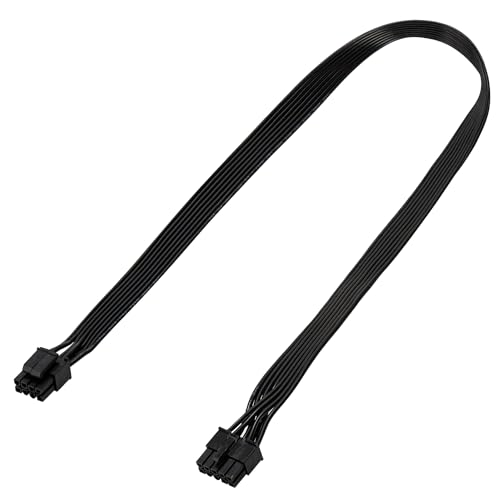

# Conector: EPS 8p (4+4)

**Descripción breve:** Conector principal que alimenta la CPU en placas base. 
**Pines/Carriles/Voltajes/Velocidad:** 8 pines (divisible 4+4) · +12V  
**Uso principal:** Alimentación directa a la CPU (procesador) mediante el conector EPS de la placa base. 
**Compatibilidad actual:** Alta

## Identificación física
- Bloque rectangular de 8 pines (puede dividirse en dos bloques de 4), con clip de seguridad, situado cerca del zócalo del procesador en la placa base.

## Notas técnicas
- Estándar EPS12V, ATX12V 2.x. No confundir con el conector PCIe de 8 pines para GPU: la posición de las muescas y el cableado es distinto.

## Fotos

## Fuentes
- https://support.exxactcorp.com/hc/en-us/articles/20180443940119-PCIe-8-pin-vs-EPS-12V-8-pin-power-connections