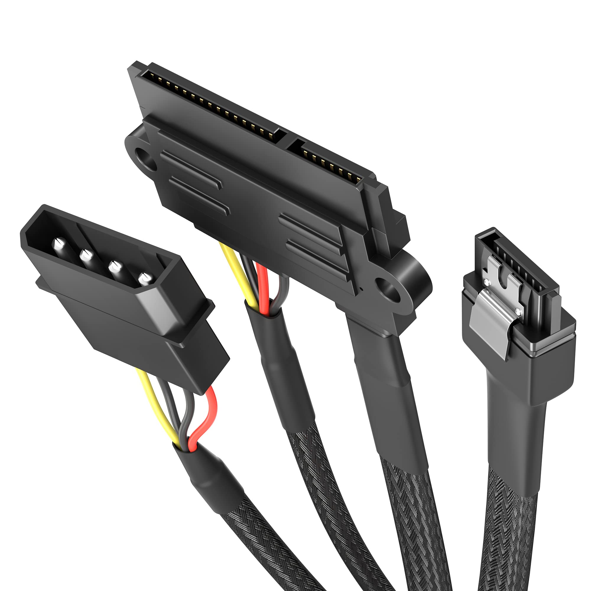

# Conector: SATA POWER

**Descripción breve:** Conector estándar de alimentación para discos duros, SSD y unidades ópticas con interfaz SATA. 
**Pines/Carriles/Voltajes/Velocidad:** 15 pines · +3.3V, +5V, +12V    
**Uso principal:** Alimentación de discos duros, SSD y unidades ópticas SATA. 
**Compatibilidad actual:** Alta

## Identificación física
- Conector plano y alargado de 15 pines, fácilmente distinguible por su forma y cortes rectangulares. Habitualmente se conecta al lateral de discos SATA.

## Notas técnicas
- Los 15 pines suministran tres voltajes (+3.3V, +5V, +12V) y múltiples pines para tierra, mejorando la entrega de corriente y permitiendo funciones como hot swapping.

## Fotos

## Fuentes
- https://pinoutguide.com/Power/sata-power_pinout.shtml