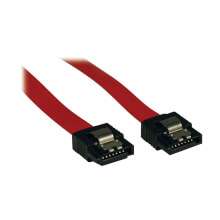

# Conector de datos: SATA (Serial ATA)

**Descripción breve:** Conector estándar de transmisión de datos usado en discos duros, SSD y unidades ópticas SATA. Permite altas velocidades de transferencia y conexión sencilla hot swap.   
**Pines/Carriles/Voltajes/Velocidad:** 7 pines · Serial ATA · Velocidades desde 1.5 Gbps (SATA I) hasta 6 Gbps (SATA III)   
**Uso principal:** Conexión de almacenamiento interno moderno: HDD, SSD, lectores/grabadores SATA 
**Compatibilidad actual:** Alta

## Identificación física
- Conector plano y alargado de 7 contactos, con una muesca que impide la conexión incorrecta. Se conecta en el lateral del dispositivo de almacenamiento.

## Notas técnicas
- El cable de datos SATA se diferencia del conector de alimentación SATA (15 pines).

Permite conexión/desconexión en caliente (hot swap) según soporte de la placa/controladora.

Retrocompatible: dispositivos SATA III pueden funcionar en puertos SATA II/I y viceversa, aunque la velocidad se adapta al estándar más bajo.

## Fotos

## Fuentes
- https://en.wikipedia.org/wiki/SATA
