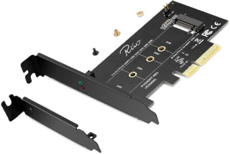

# Slot: M.2 (slot de expansión para Wi-Fi/BT, Key E)

**Descripción breve:** Ranura de expansión interna M.2 Key E específicamente destinada a módulos inalámbricos, como tarjetas Wi-Fi, Bluetooth y otros dispositivos de conectividad. Permite añadir capacidades de red inalámbrica fácilmente en placas base modernas, ordenadores de sobremesa y portátiles.
**Pines/Carriles/Voltajes/Velocidad:**Hasta 75 pines contactos · Alimentación 3.3V (típico) · PCIe x1 (hasta Gen3), USB 2.0, UART, SDIO para comunicación con el módulo
**Uso principal:**  Instalación de tarjetas/mini-módulos Wi-Fi, Bluetooth, WWAN, GPS, NFC y, ocasionalmente, módulos de almacenamiento o radio.  
**Compatibilidad actual:** Alta

## Identificación física
- Conector M.2 pequeño (Key E), con muesca lateral característica.

- Habitualmente en formatos cortos (2230, 1630 mm de largo); el slot suele estar cerca del módulo de CPU o puertos de expansión, y puede tener soportes para antenas externas.

## Notas técnicas
- Sólo módulos compatibles con Key E pueden conectarse (no compatible con Key B/M de almacenamiento).

- Permite módulos combinados Wi-Fi y Bluetooth en un solo dispositivo.

- Incluye líneas para USB, UART y, en algunos casos, interfaces adicionales como SDIO o PCIe x1 según la tarjeta utilizada.

- Algunos modelos soportan funciones avanzadas como radio FM, NFC o WAN además de Wi-Fi/Bluetooth.

## Fotos

## Fuentes
- https://www.nxp.com.cn/docs/en/application-note/AN13049.pdf

- https://en.wikipedia.org/wiki/M.2 