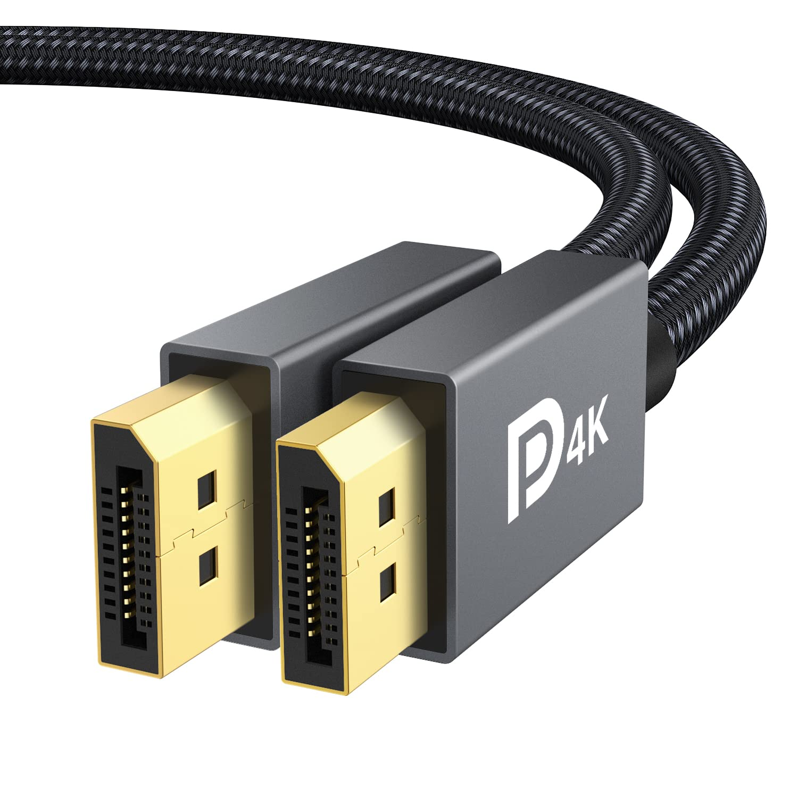

# Conector externo: DisplayPort 1.4/2.x

**Descripción breve:**  Interfaz digital de vídeo y audio especialmente diseñada para monitores de alta resolución, estaciones profesionales y tarjetas gráficas. Las versiones recientes DisplayPort 1.4 y 2.x soportan resoluciones superiores a 4K, altas tasas de refresco y varias funciones avanzadas para gaming y productividad.
**Pines/Carriles/Voltajes/Velocidad:** 20 pines 
· 3.3V/500mA 
· DisplayPort 1.4 hasta 32.4 Gbps (25.9 Gbps útiles) 
· DisplayPort 2.1 hasta 80 Gbps (UHBR20, 77.4 Gbps útiles)

USB 3.x: 9 pines (5 adicionales respecto a 2.0) · +5V · Hasta 5 Gbps (USB 3.0)  
**Uso principal:** Conexión de monitores, estaciones de trabajo gráficas, GPUs, docks profesionales y pantallas de alta gama.
**Compatibilidad actual:** Muy alta. DP 2.x es retrocompatible por hardware con DP 1.4/1.2; se requiere cable certificado UHBR para mayores velocidades.

## Identificación física
- Conector plano de 20 pines, similar al USB pero más ancho.

- Disponible en tamaño estándar (“full size”) y Mini DisplayPort, ambos con 20 pines.

- El conector estándar tiene pestaña de bloqueo, en miniDP no.

- Suele ubicarse en la parte trasera de periféricos y equipos de sobremesa.

## Notas técnicas
- DisplayPort 1.4 soporta hasta 4K@120Hz y 8K@60Hz (con DSC), HDR10, audio multicanal, Multi-Stream Transport (MST) y modo alternativo por USB-C.

- DisplayPort 2.x incrementa el ancho de banda: hasta 80 Gbps, soportando 8K sin compresión y hasta 16K comprimido.

- Compatible con adaptadores pasivos a HDMI/DVI (DP++), soporta Daisy Chain y conexión multipantalla.

- Alimenta adaptadores con 3.3V/500mA desde el pin 20, soporte hot-plug.

## Fotos

## Fuentes
- https://www.eaton.com/us/en-us/products/backup-power-ups-surge-it-power-distribution/backup-power-ups-it-power-distribution-resources/cpdi-vertical-marketing/displayport-explained.html

- https://www.eaton.com/us/en-us/products/backup-power-ups-surge-it-power-distribution/backup-power-ups-it-power-distribution-resources/cpdi-vertical-marketing/displayport-explained.html

- https://www.displayport.org/faq/