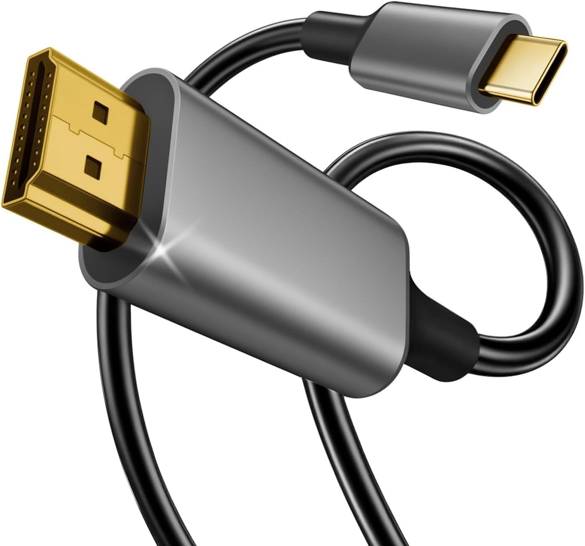

# Conector externo: HDMI 2.1

**Descripción breve:** Estándar de interfaz multimedia digital que permite transferir audio y vídeo de alta resolución sin compresión, así como datos y canal Ethernet. HDMI 2.1 es la última gran revisión, compatible con alta tasa de refresco, 8K/10K y mejoras importantes en características audiovisuales.  
**Pines/Carriles/Voltajes/Velocidad:**  19 pines (Type A, estándar) · Hasta 48 Gbps sin comprimir (FRL) · Hasta 128 Gbps comprimido (DSC) · Soporte para vídeo 4K@120Hz, 8K@60Hz, 10K · Audio digital multicanal, eARC, Dolby Atmos, HDR dinámico
**Uso principal:**  Conexión de monitores, televisores, tarjetas gráficas, consolas, barras de sonido y equipos audiovisuales de última generación.
**Compatibilidad actual:** Alta con HDMI 1.4/2.0 tanto en hardware como en cables, aunque para 8K y funciones avanzadas se requieren cables “Ultra High Speed”.

## Identificación física
- Conector plano y ancho de 19 pines, de 14 x 4,5 mm (Tipo A estándar).

- El cabezal suele estar marcado con el logo “HDMI” y la generación del cable (High Speed, Premium, Ultra High Speed).

## Notas técnicas
- HDMI 2.1 incrementa la tasa máxima hasta 48 Gbps (FRL: Fixed Rate Link) y introduce soporte para vídeo comprimido (DSC) alcanzando 128 Gbps efectivos.

- Permite 4K@120Hz, 8K@60Hz, hasta 10K en monitores de próxima generación, con HDR dinámico y soporte eARC, ALLM, QMS y VRR.

- Compatible hacia atrás; los dispositivos negociarán la máxima velocidad y características soportadas ambos lados.

- Require cables Ultra High Speed para aprovechar el ancho de banda máximo
## Fotos

## Fuentes
- https://en.wikipedia.org/wiki/HDMI

- https://www.bluejeanscable.com/articles/hdmi-2-1-cable-48g.html

- https://www.eaton.com/us/en-us/products/backup-power-ups-surge-it-power-distribution/backup-power-ups-it-power-distribution-resources/cpdi-vertical-marketing/hdmi-explained.html