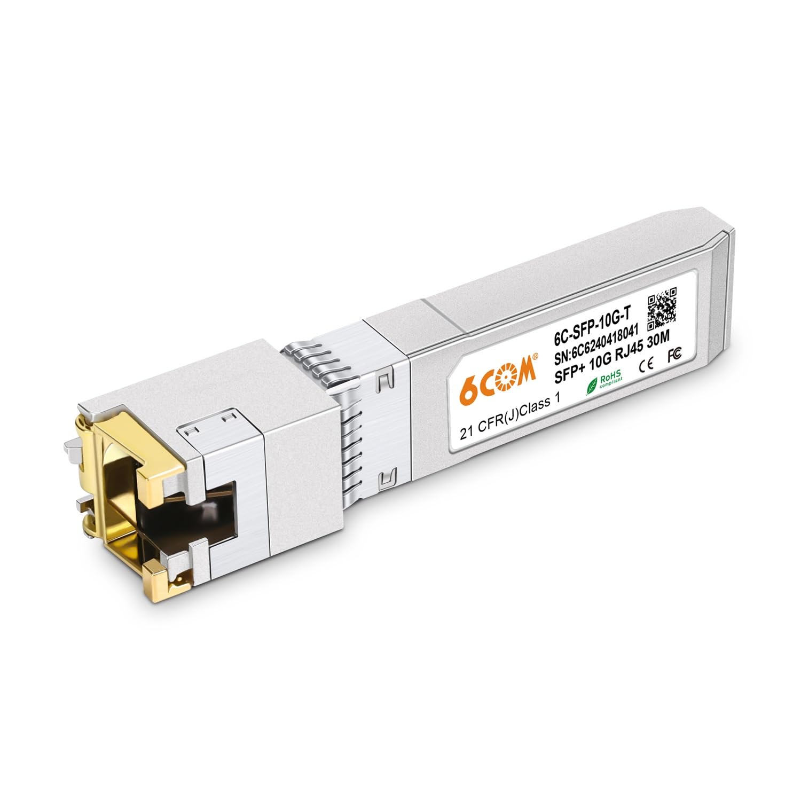

# Conector externo: RJ-45 1G/2.5G/10G.

**Descripción breve:** Conector de red estándar para Ethernet sobre cable de cobre en redes domésticas, empresariales e industriales. Soporta desde redes Fast Ethernet (100 Mbps) hasta Multi-Gigabit (2.5/5/10 Gbps, según cableado y dispositivos).  
**Pines/Carriles/Voltajes/Velocidad:**  8 pines (4 pares trenzados) · Típico 3.3V señal lógica · Hasta 1 Gbps (Gigabit) con Cat5e/Cat6, hasta 10 Gbps con Cat6a/Cat7 (hasta 100m, baja atenuación)
**Uso principal:**   Conexión de ordenadores, switches, routers, puntos de acceso y dispositivos de red mediante cables Ethernet Cat5e/Cat6/Cat6a estándar.
**Compatibilidad actual:** Alta entre equipos actuales y estándar físico RJ-45; las categorías de cable definen la velocidad máxima permitida según la especificación.

## Identificación física
- Conector plástico rectangular con 8 contactos metálicos alineados y una pestaña de seguridad flexible.

- Los cables de red emplean pares trenzados, y los colores de los pines típicamente siguen los esquemas T568A o T568B.

## Notas técnicas
- Pinout estándar: T568B es el más común. Todos los pines son usados en redes gigabit (Gigabit y superiores requieren los 4 pares trenzados).

- 1G (1000BASE-T) funciona con cualquier Cat5e/Cat6 usando los 8 pines; la transmisión es full-duplex.

- 2.5G y 5G funcionan con Cat5e (a menudo a distancias menores) y Cat6; 10G requiere Cat6a o Cat7 para mantener los 100m recomendados.

- La retrocompatibilidad es integral: puedes conectar dispositivos 10G a switches 1G y funcionarán a la máxima velocidad común de ambos lados.
## Fotos

## Fuentes
- https://www.showmecables.com/blog/post/rj45-pinout

- https://zytrax.com/tech/layer_1/cables/tech_lan.htm

- https://www.taoglas.com/blogs/what-is-an-rj45-connector/