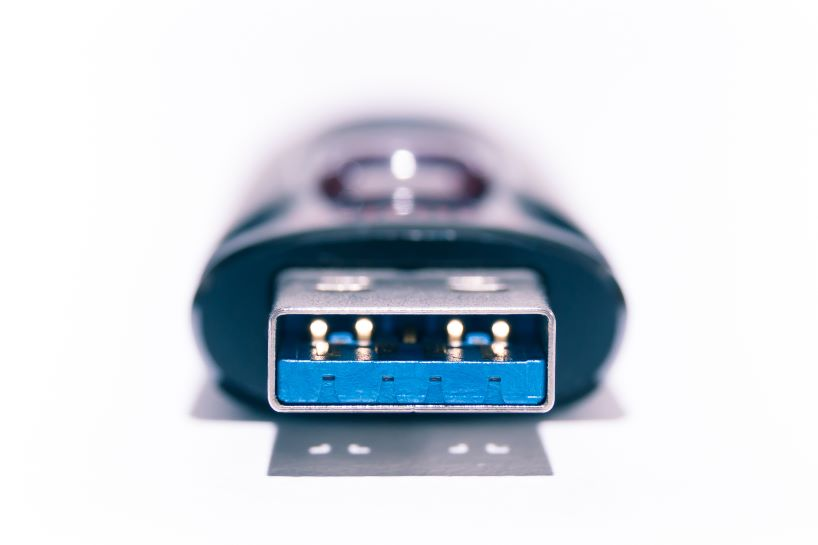

# Conector externo: USB-A 2.0/3.x

**Descripción breve:** Conector rectangular universal utilizado para la transmisión de datos y alimentación eléctrica en todo tipo de periféricos informáticos. USB 2.0 es el estándar clásico, mientras que 3.x añade pines extra para más velocidad, manteniendo la compatibilidad física hacia atrás  
**Pines/Carriles/Voltajes/Velocidad:** USB 2.0: 4 pines · +5V · 480 Mbps máx.
USB 3.x: 9 pines (5 adicionales) · +5V · hasta 5 Gbps (USB 3.0), 10 Gbps (USB 3.1), 20 Gbps (USB 3.2 Gen2x2)
**Uso principal:**  Transferencia de datos, carga/energía, conexión de teclados, ratones, memorias externas, impresoras…    
**Compatibilidad actual:** Alta (ojo: no todo USB-C soporta TB/PD)

## Identificación física
- Conector plano y rectangular de 12 mm (típico “USB clásico”), presencia en la mayoría de PCs y periféricos USB.

- USB 2.0 tiene 4 pines; los USB 3.x añaden 5 pines extra en el fondo del conector (parte posterior, no siempre visible), pero físicamente son iguales.

## Notas técnicas
- USB 2.0 solo usa 4 pines: +5V, D-, D+, GND.

- USB 3.x añade dos pares diferencial para SuperSpeed (SSTX+, SSTX−, SSRX+, SSRX−) y un pin tierra extra, logrando comunicación dúplex y mayor velocidad.

- Los dispositivos USB 2.0 funcionan sin problemas en puertos USB 3.x (y viceversa), aunque con las limitaciones de la generación más lenta
## Fotos

## Fuentes
- https://www.aggsoft.com/usb-pinout-cable/usb3.htm

- https://www.aikeelectronics.com/resources/usb-2-0-usb-3-0-usb-3-1-usb-3-2-usb-4-0-connectors-and-pinouts.html

- https://en.wikipedia.org/wiki/USB_hardware