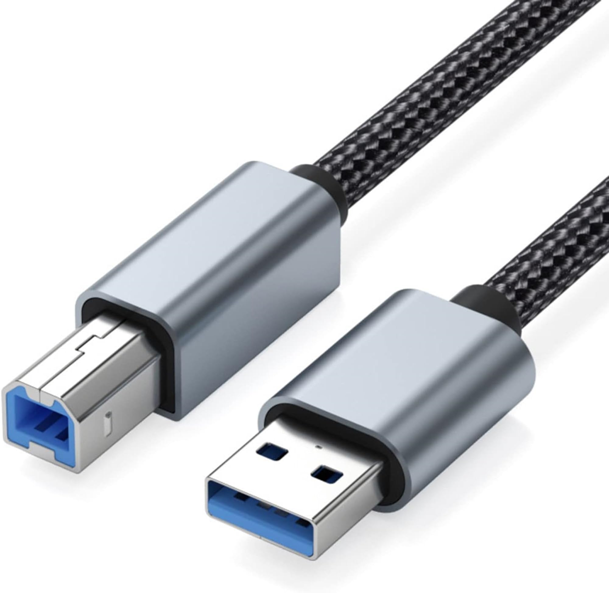

# Conector externo: USB-B

**Descripción breve:**  Conector cuadrado/rectangular clásico utilizado como “puerto periférico” en impresoras, escáneres, hubs USB y otros dispositivos de sobremesa. USB-B es el conector estándar en el lado del dispositivo, mientras el host usa USB-A.
**Pines/Carriles/Voltajes/Velocidad:** USB 2.0: 4 pines · +5V · Hasta 480 Mbps

USB 3.x: 9 pines (5 adicionales respecto a 2.0) · +5V · Hasta 5 Gbps (USB 3.0)  
**Uso principal:**Enlace de impresoras, hubs USB, interfaces de audio, escáneres, algunos discos y hardware profesionals  
**Compatibilidad actual:** Alta entre dispositivos USB-B 2.0 y 3.x; los dispositivos y cables USB 3.x tienden a tener el interior del conector en azul o turquesa.

## Identificación física
- Forma cuadrada/rectangular con esquinas biseladas. USB-B 2.0 es más simple y USB-B 3.x es ligeramente más grueso (incluye una sección extra con pines de SuperSpeed).

Suele ubicarse en la parte trasera de periféricos y equipos de sobremesa.

## Notas técnicas
- USB-B 2.0 utiliza 4 pines: VBUS (+5V), D-, D+ y GND.

USB-B 3.x añade otras líneas para datos de alta velocidad (SuperSpeed), llegando a 9 pines que permiten comunicación dúplex y mayores tasas de transferencia.

USB-B mini/micro existen para equipos compactos, con variantes y formas específicas, pero el concepto de alimentación y datos es el mismo.

## Fotos

## Fuentes
- https://autowiringpro.com/usb-b-type-connector/

- https://www.aggsoft.com/usb-pinout-cable/usb2.html